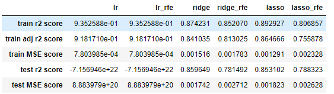

# House Price Analysis-Advanced Regression Assignment
> In this project, we try to analyze a housing sales dataset to find the best features that influence the Sales price of a house in Australian Market. We build a linear regression model and increase the robustness of the model we use Ridge and Lasso regularization to reduce the overfitting as well as to reduce the complexity of the model.

## Table of Contents
* [General Info](#general-information)
* [Technologies Used](#technologies-used)
* [Conclusions](#conclusions)
* [Acknowledgements](#acknowledgements)

<!-- You can include any other section that is pertinent to your problem -->

## General Information
<!--- Provide general information about your project here.
- What is the background of your project?
- What is the business probem that your project is trying to solve?
- What is the dataset that is being used? -->
> _Problem Statement:_
>
> A US-based housing company named Surprise Housing has decided to enter the Australian market. The company uses data analytics to purchase houses at a price below their actual values and flip them on at a higher price. For the same purpose, the company has collected a data set from the sale of houses in Australia. The data is provided in the CSV file below.
>
>The company is looking at prospective properties to buy to enter the market. You are required to build a regression model using regularisation in order to predict the actual value of the prospective properties and decide whether to invest in them or not.
>
>The company wants to know:
>
>Which variables are significant in predicting the price of a house, and
>
>How well those variables describe the price of a house.
>
>Also, determine the optimal value of lambda for ridge and lasso regression.

The dataset being used contains various attributes of a house, such as how old it is, number of bedrooms, number of stories, road access etc along with the Sales Price of the house at which the house was sold. The Analysis should be able to tell the most important predictors as well as predict the price of a new house at which it should be sold. 

Below is the list of all the columns present in the dataset:Total 81 columns

`'Id', 'MSSubClass', 'MSZoning', 'LotFrontage', 'LotArea', 'Street',
'Alley', 'LotShape', 'LandContour', 'Utilities', 'LotConfig',
'LandSlope', 'Neighborhood', 'Condition1', 'Condition2', 'BldgType',
'HouseStyle', 'OverallQual', 'OverallCond', 'YearBuilt', 'YearRemodAdd',
'RoofStyle', 'RoofMatl', 'Exterior1st', 'Exterior2nd', 'MasVnrType',
'MasVnrArea', 'ExterQual', 'ExterCond', 'Foundation', 'BsmtQual',
'BsmtCond', 'BsmtExposure', 'BsmtFinType1', 'BsmtFinSF1',
'BsmtFinType2', 'BsmtFinSF2', 'BsmtUnfSF', 'TotalBsmtSF', 'Heating',
'HeatingQC', 'CentralAir', 'Electrical', '1stFlrSF', '2ndFlrSF',
'LowQualFinSF', 'GrLivArea', 'BsmtFullBath', 'BsmtHalfBath', 'FullBath',
'HalfBath', 'BedroomAbvGr', 'KitchenAbvGr', 'KitchenQual',
'TotRmsAbvGrd', 'Functional', 'Fireplaces', 'FireplaceQu', 'GarageType',
'GarageYrBlt', 'GarageFinish', 'GarageCars', 'GarageArea', 'GarageQual',
'GarageCond', 'PavedDrive', 'WoodDeckSF', 'OpenPorchSF',
'EnclosedPorch', '3SsnPorch', 'ScreenPorch', 'PoolArea', 'PoolQC',
'Fence', 'MiscFeature', 'MiscVal', 'MoSold', 'YrSold', 'SaleType',
'SaleCondition', 'SalePrice'`

<!-- You don't have to answer all the questions - just the ones relevant to your project. -->

## Conclusions
- Simple Linear Regression doesnt work well and test RMSE and test r2 score is really bad
- After RFE also, the linear regression model doesnt do well and test metrics are bad
- With Ridge regularisation, the train and test r2 score are very close and train adjusted r2 score is also really good.
- With Lasso regularisation as well, the train and test r2 score are very close and train adjusted r2 score is also really good.
- But the ridge regularisation does slightly better to reduce overfitting

<!-- You don't have to answer all the questions - just the ones relevant to your project. -->

## Technologies Used
- Numpy - version 1.23.2
- Pandas - version 1.4.3
- Scikit-learn - version 1.1.2
- matplotlib - version 3.5.3

Complete package list used is mentioned in requirements.txt file

<!-- As the libraries versions keep on changing, it is recommended to mention the version of library used in this project -->

## Acknowledgements
Give credit here.
- References if any...
  - https://pandas.pydata.org/pandas-docs/stable/index.html
  - https://numpy.org/doc/
  - https://stackoverflow.com/
- This project was based on [this upgrad course](https://www.upgrad.com/data-science-pgd-iiitb/).

## Contact
Created by [@shyamsundarshukla1991] - feel free to contact me!

<!-- Optional -->
<!-- ## License -->
<!-- This project is open source and available under the [... License](). -->

<!-- You don't have to include all sections - just the one's relevant to your project -->